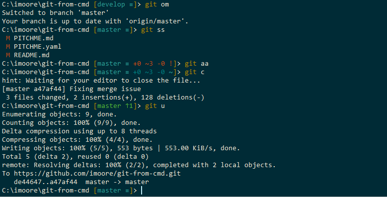

---?image=assets/img/bg/orange.jpg&position=right&size=50% 100%
@title[GIT via CMD]

@snap[west text-16 text-bold text-italic text-orange span-50]
GIT via CMD
@snapend

+++?image=assets/img/bg/orange.jpg&position=right&size=50% 100%
@title[GIT via CMD]

@snap[west text-16 text-bold text-italic text-orange span-50]
GIT via CMD
@snapend

@snap[east text-white span-45]
@ol[split-screen-list text-08](false)
- Best place to learn git and become proficient
- The command line is a sort of 'lingua franca'
- The command line lets you know exactly what you do, exactly when you do it.
@olend
@snapend

+++?image=assets/img/bg/orange.jpg&position=right&size=50% 100%
@title[GIT via CMD]

@snap[west text-16 text-bold text-italic text-orange span-50]
Best place to learn git.
@snapend

@snap[east text-white span-45]
Understanding of the commands git uses and knowing which command does what.
@snapend

+++?image=assets/img/bg/orange.jpg&position=right&size=50% 100%
@title[GIT via CMD]

@snap[west text-16 text-bold text-italic text-orange span-50]
The command line is a sort of 'lingua franca'.
@snapend

@snap[east text-white span-45]
No matter what your development platform, you can use the command line to do what you want. Relatedly, if you look for help with Git online, you’ll probably find directions for the command line.
@snapend

+++?image=assets/img/bg/orange.jpg&position=right&size=50% 100%
@title[GIT via CMD]

@snap[west text-16 text-bold text-italic text-orange span-50]
    The command line lets you know exactly what you do, exactly when you do it.
@snapend

@snap[east text-white span-45]
Using a GUI for git means relying much more on the code of other developers, and there's no guarantee that their program will work precisely the way you intend it to. Using the command line you know exactly what is happening and when its happening.
@snapend

+++?image=assets/img/bg/orange.jpg&position=right&size=50% 100%
@title[GIT via CMD]

@snap[west text-16 text-bold text-italic text-orange span-50]
    The Tool set.
@snapend

@snap[east text-white span-45]
@ol[split-screen-list text-08](false)
- [Git](https://git-scm.com/)
- [ConEmu](https://conemu.github.io)
    fast and reliable terminal window
- [Posh-Git](https://github.com/dahlbyk/posh-git)
    A PowerShell script with GIT integration
@olend
@snapend

+++?code=assets/src/bash/standard-checkout.txt&lang=bash
@title[Standard Git Checkout Process]

@[1](Already on the project path)
@[2](Do a fetch to retrieve any new branches on the server)
@[3](Do a pull to update my local branch with any changes)
@[4](Do a checkout to create a new feature branch based on branch name)
@[5](Set the upstream for the branch to the remote server)

@snap[north-east template-note text-gray]
Standard Git Checkout Process.
@snapend

+++?code=assets/src/bash/my_process.txt&lang=bash
@title[My Git Checkout Process]

@[1-2](Thats it)

@snap[north-east template-note text-gray]
My Git Checkout Process.
@snapend

+++?code=assets/src/bash/gitalias.config&lang=bash
@title[GIT Alias File]

@[2](Alias for git add cmd)
@[3](Alias for git commit cmd)
@[4-6](Alias for git push and git merge cmd)
@[7-10](My process for GIT checkout)

@snap[north-east template-note text-gray]
GIT Alias File.
@snapend

+++?code=assets/src/bash/gitconfig.config&lang=bash
@title[GIT Alias File]

@[20-21](Adding the alias file)

@snap[north-east template-note text-gray]
GIT Alias File.
@snapend

+++
@title[GIT commit steps]

@snap[north-east template-note text-gray]
GIT commit steps
@snapend

+++
@title[Q&A]

@snap[north-east template-note text-gray]
Any Questions
@snapend